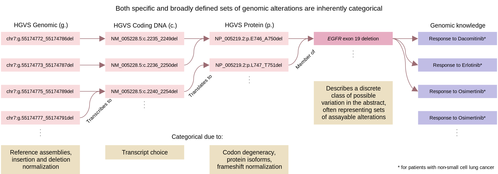

Both specific and broadly defined sets of genomic alterations are inherently categorical. The following genomic alterations are used as an illustrative example of EGFR Exon 19 deletions:
- [chr7:g.55174772_55174786del](https://grch38.genomenexus.org/variant/chr7:g.55174772_55174786del); NM_005228.5(EGFR):c.2235_2249del(p.E746_A750del)
- [chr7:g.55174773_55174787del](https://grch38.genomenexus.org/variant/chr7:g.55174773_55174787del); NM_005228.5(EGFR):c.2236_2250del(p.E746_A750del)
- [chr7:g.55174775_55174789del](https://grch38.genomenexus.org/variant/chr7:g.55174775_55174789del); NM_005228.5(EGFR):c.2240_2254del(p.L747_T751del)
- [chr7:g.55174777_55174791del](https://grch38.genomenexus.org/variant/chr7:g.55174775_55174789del); NM_005228.5(EGFR):c.2240_2254del(p.L747_T751del)
